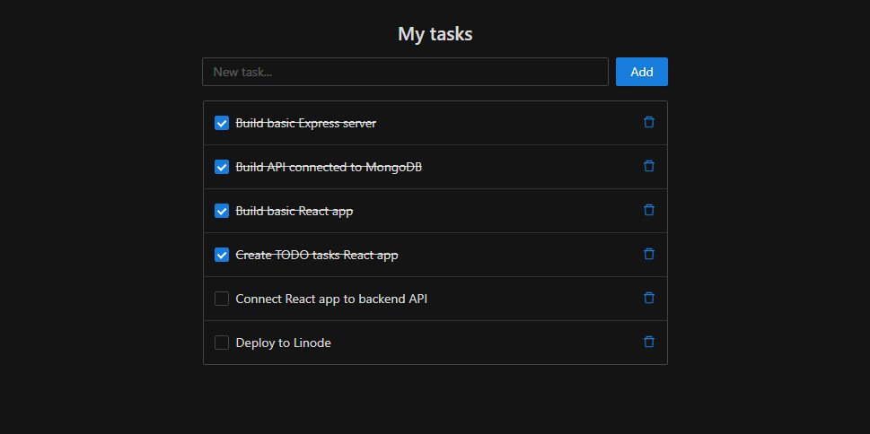

# Tutorial
This tutorial demonstrates how to create MERN (MongoDB, Express, React, Node.js) application on Linode. You may use code in `./server` and `./client` for the reference on end result.

At the end of tutorial you will have TODO web application hosted on Linode server alongside with MongoDB and Node backend.

# Prerequisites
* Node.js and yarn installed on local dev machine.
* MongoDB database installed on local dev machine.

# Create MERN app from scratch

1. Create new folder to be the root of your new Node.js application.

2. Create two folders `./server` and `./client`, which will hold backend and frontend.

## Create Express backend

1. Enter folder `./server`:
```bash
cd server
```

2. Run ```yarn init``` and follow prompts from command line:
```bash
yarn init
```

3. Add production depenendency on Express Node.js framework:
```bash
yarn add -E express
```

4. Add file `./server/index.js` with the content for minimal Express server:

```javascript
const express = require("express");

const app = express();

const port = process.env.PORT || 5000;

app.use((req, res, next) => {
  res.send("Welcome to Express");
});

app.listen(port, () => {
  console.log(`Server running on port ${port}`);
});
```

5. Run the server and check it is working:
```bash
node index.js
```

6. Add production dependency on MongoDB client and modelling utility:
```bash
yarn add -E mongoose
```

6. Add file `./server/models/tasks.js` with the content:
```javascript
const mongoose = require("mongoose");
const Schema = mongoose.Schema;

//create schema for tasks
const TasksSchema = new Schema({
  action: {
    type: String,
    required: [true, "The action text field is required"],
  },
  completed: {
    type: Boolean,
    required: [false],
  },
});

//create model for tasks
const Tasks = mongoose.model("tasks", TasksSchema);

module.exports = Tasks;
```

7. Add file `./routes/api.js` with the content:

```javascript
const express = require("express");
const router = express.Router();
const Tasks = require("../models/tasks");

router.get("/tasks", (req, res, next) => {
  Tasks.find({}, ["action", "completed"])
    .then((data) => res.json(data))
    .catch(next);
});

router.post("/tasks", (req, res, next) => {
  if (req.body.action) {
    Tasks.create(req.body)
      .then((data) => res.json(data))
      .catch(next);
  } else {
    res.status(400).json({
      error: "The 'action' field is empty",
    });
  }
});

router.put("/tasks/:id", (req, res, next) => {
  Tasks.findOneAndUpdate({ _id: req.params.id }, req.body, { new: true })
    .then((data) => res.json(data))
    .catch(next);
});

router.delete("/tasks/:id", (req, res, next) => {
  Tasks.findOneAndDelete({ _id: req.params.id })
    .then((data) => res.json(data))
    .catch(next);
});

module.exports = router;
```

8. Add production dependency on Express middleware:
```bash
yarn add -E body-parser
```

9. Update the content of `./server/index.js` with:
```javascript
const express = require("express");
const bodyParser = require("body-parser");
const mongoose = require("mongoose");
const routes = require("./routes/api");

const app = express();
const port = process.env.PORT || 5000;
const mongoDBConnectionString = process.env.MONGODB;

if (!mongoDBConnectionString) {
  console.error(`Not found connection string in "MONGODB" environment variable, exiting.`);
  process.exit(1);
}

//connect to the database
mongoose
  .connect(mongoDBConnectionString, { useNewUrlParser: true })
  .then(() => console.log(`Database connected successfully`))
  .catch((err) => console.log(err));

//since mongoose promise is depreciated, we overide it with node's promise
mongoose.Promise = global.Promise;

app.use(bodyParser.json());

app.use("/", express.static("public"));
app.use("/api", routes);

app.use((err, req, res, next) => {
  console.log(err);
  next();
});

app.listen(port, () => {
  console.log(`Server running on port ${port}`);
});
```

10. Add development dependency to setup environment variables:
```bash
yarn add -D -E dotenv
```

11. Create file `./server/.env` which defines environment variable `MongoDB` holding connection string to your MongoDB:
```
MONGODB=REPLACE_WITH_YOUR_CONNECTION_STRING
```

12. Run server again and check your server works as expected (`-r dotenv/config` is needed to set environment variables):
```bash
node -r dotenv/config index.js
```

13. Test your API server. If you use VSCode you may test API using extension [REST Client](https://marketplace.visualstudio.com/items?itemName=humao.rest-client) and file `./server/test.http` with following content:
```
##
## This is test file which can be executed with REST Client VSCode extension:
## https://marketplace.visualstudio.com/items?itemName=humao.rest-client
##

### Get tasks
GET http://localhost:5000/api/tasks HTTP/1.1

#### Add task
# @name newTask
POST http://localhost:5000/api/tasks HTTP/1.1
content-type: application/json

{
  "action": "Test API of my MERN TODO application",
  "completed": false
}

### Get tasks to see new task returned
GET http://localhost:5000/api/tasks HTTP/1.1

#### Update task
PUT http://localhost:5000/api/tasks/{{id}} HTTP/1.1
content-type: application/json

{
  "completed": true
}

### Get tasks to see new task updated
GET http://localhost:5000/api/tasks HTTP/1.1

### Delete new task
@id = {{newTask.response.body.$._id}}
DELETE http://localhost:5000/api/tasks/{{id}} HTTP/1.1
```

14. Add startup script to `./server/package.json` as first property:
```javascript
  "scripts": {
    "start": "node -r dotenv/config index.js"
  },
```

15. Now you can start server with simple command:
```bash
  yarn start
```

## Create React frontend

1. Go to project root `./` and run:
```bash
yarn create react-app client
```

2. This creates empty React app in `./client` folder. Enter this folder:
```bash
cd client
```

3. Check that your React application runs normally:
```bash
yarn start
```

4. Add production dependency on `antd` UX library and icons:
```bash
yarn add -E antd
yarn add -E @ant-design/icons
```

5. Update `./client/src/App.js` with:
```javascript
import React from "react";
import { Button, Row, Col, Input, Form, List, Typography, Checkbox, Spin, Result, Empty } from "antd";
import { DeleteOutlined } from "@ant-design/icons";
import { TaskService } from "./TaskService.js";

import "antd/dist/antd.dark.css";
import "./App.css";

class App extends React.Component {
  constructor(props) {
    super(props);
    this.formRef = React.createRef();
    this.taskService = new TaskService();
    this.state = { isLoading: true, tasks: [], error: undefined };
  }

  componentDidMount() {
    this.loadTasks();
  }

  async loadTasks() {
    try {
      const tasks = await this.taskService.get();
      this.setState({ isLoading: false, tasks: tasks, error: undefined });
    } catch (error) {
      this.setState({ isLoading: false, tasks: [], error: error });
    }
  }

  add = async (values) => {
    try {
      const task = values.task;
      await this.taskService.add(task);
      this.formRef.current.resetFields();
      await this.loadTasks();
    } catch (error) {
      this.setState({ error: error });
    }
  };

  updateCompleted = async (item, completed) => {
    try {
      await this.taskService.updateCompleted(item, completed);
      await this.loadTasks();
    } catch (error) {
      this.setState({ error: error });
    }
  };

  delete = async (item) => {
    try {
      await this.taskService.delete(item);
      await this.loadTasks();
    } catch (error) {
      this.setState({ error: error });
    }
  };

  render() {
    return (
      <div className="App">
        <Row justify="center">
          <Col>
            <h2>My tasks</h2>
          </Col>
        </Row>
        <Row justify="center">
          <Col>
            <Form ref={this.formRef} layout="inline" onFinish={(values) => this.add(values)}>
              <Form.Item name="task" rules={[{ required: true, message: "Task cannot be empty" }]}>
                <Input placeholder="New task..." style={{ width: "453px", marginRight: "8px" }} />
              </Form.Item>
              <Form.Item>
                <Button type="primary" htmlType="submit">
                  Add
                </Button>
              </Form.Item>
            </Form>
          </Col>
        </Row>
        <Row justify="center" style={{ marginTop: "16px" }}>
          <Col>
            <Spin spinning={this.state.isLoading}>
              {this.state.error ? (
                <Result
                  status="500"
                  title="500"
                  subTitle="Sorry, something went wrong."
                  extra={JSON.stringify(this.state.error)}
                />
              ) : (
                <List
                  bordered
                  style={{ width: "518px" }}
                  dataSource={this.state.tasks}
                  locale={{ emptyText: <Empty description="No tasks yet..." /> }}
                  renderItem={(item) => (
                    <List.Item>
                      <Checkbox checked={item.completed} onChange={(e) => this.updateCompleted(item, e.target.checked)}>
                        <Typography.Text delete={item.completed}>{item.action}</Typography.Text>
                      </Checkbox>
                      <Button type="link" size="small" onClick={() => this.delete(item)}>
                        <DeleteOutlined />
                      </Button>
                    </List.Item>
                  )}
                />
              )}
            </Spin>
          </Col>
        </Row>
      </div>
    );
  }
}

export default App;
```

6. Update `./client/src/App.css` with:
```css
body {
  background-color: #141414;
}

.App {
  padding-top: 20px;
}

.ant-form-inline .ant-form-item {
  margin-right: 0;
}

.ant-form-inline .ant-form-item-with-help {
  margin-bottom: 0;
}

.ant-list-bordered .ant-list-item {
  padding-left: 12px;
  padding-right: 12px;
}

.ant-btn-sm {
  padding-left: 0;
  padding-right: 0;
}
```

7. Create new file `./client/src/TaskService.js` with hardcoded data for now:
```javascript
const data = [
  { action: "Build basic Express server", completed: true },
  { action: "Build API connected to MongoDB", completed: true },
  { action: "Build basic React app", completed: true },
  { action: "Create TODO tasks React app", completed: true },
  { action: "Connect React app to backend API", completed: false },
  { action: "Deploy to Linode", completed: false },
];

export class TaskService {
  async get() {
    return data;
  }

  async updateCompleted(task, completed) {
    console.log("Updating task with completed state:", task, completed);
  }

  async add(action) {
    console.log("Creating task with action:", action);
  }

  async delete(task) {
    console.log("Deleting task:", task);
  }
}
```

8. From `./client` folder check UX again:
```bash
yarn start
```
You should see the result like this:



9. Now add production dependency on http client utility:
```bash
yarn add -E axios
```

10. Update `./client/src/TaskService.js` with the code going to backend:
```javascript
import axios from "axios";

export class TaskService {
  async get() {
    const response = await axios.get("/api/tasks");
    return response.data;
  }

  async updateCompleted(task, completed) {
    await axios.put(`/api/tasks/${task._id}`, { completed: completed });
  }

  async add(task) {
    await axios.post(`/api/tasks`, { action: task });
  }

  async delete(task) {
    await axios.delete(`/api/tasks/${task._id}`);
  }
}

```

11. Add development dependency on utility for cross-platform folder copy:
```bash
yarn add -D -E copyfiles
```

12. Update client build script to copy optimized static files to `./server`. For that in `./client/package.json` find this line:
```javascript
  "build": "react-scripts build",
```
and replace with this line:
```javascript
  "build": "react-scripts build && copyfiles -E -u 1 './build/**/*' ../server/public/",
```

11. Run build inside `./client/` folder:
```bash
yarn build
```

12. Now go to `./server` folder and start server there:
```bash
cd ../server
yarn start
```

13. Check your application runs correctly. You are done with steps on your local machine!

# Deploy on Linode server

1. Deploy Node.js server using these instructions: [TODO: update docs on deploying Node.js app using Abberit Admin Panel].

2. Deploy MongoDB using these instructions: [TODO: update docs on deploying MongoDB using Abberit Admin Panel].

3. Configure Node.js to use MongoDB: [TODO: update docs on manipulating app settings using Abberit Admin Panel].

4. Try everything working on Linode!
